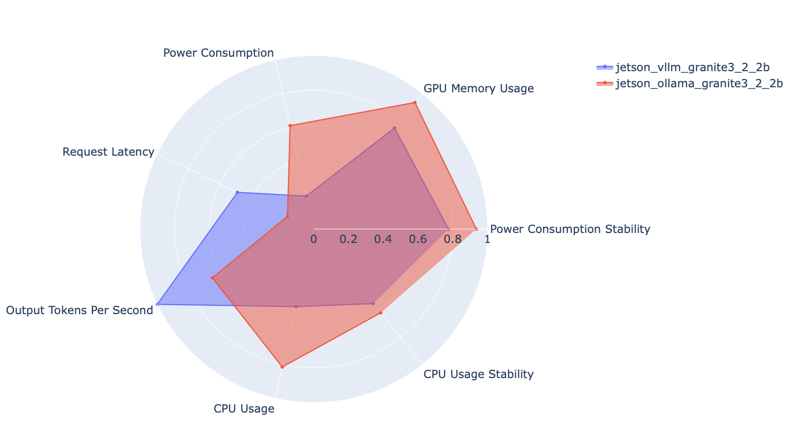

# AI Inference - A methodology for testing and comparing metrics of various AI stacks

The project displays on a Grafana Dashboard an array of metrics including:
- Power Consumption
- Memory Usage
- CPU Usage
- Latency/Throughput (vLLM only)
- Misc

radar.py after running a test will produce a side-by-side visual summary:

Right now, the project is configured for Jetson machines only

## Installation and Setup

- Must have [Jumpstarter](https://jumpstarter.dev/main/) installed

After cloning this repo, get a lease with Jumpstarter:

`uv run jmp shell -l board=orin-agx`

Then, you will have to configure line 18 on jetson.py for the path to your ssh key:

`CONTAINER_SSHKEY = "/Users/USERNAME/.ssh/id_ed25519"`

### Running the Project

`python run.py` will by default search for a configuration file named `run_config.yaml` in the same directory, but `--config_path` to change the name of the file that it will be looking for. See run_config.yaml for an example of what the yaml syntax should look like.

#### After getting the lease, you will have to add `--powercycle True` the first time you run the project

Once running, metrics will be visible on port 3000.
