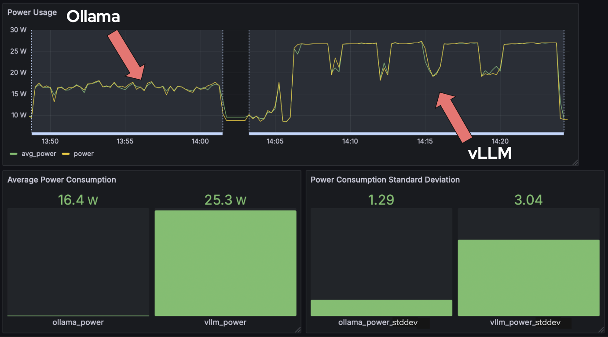
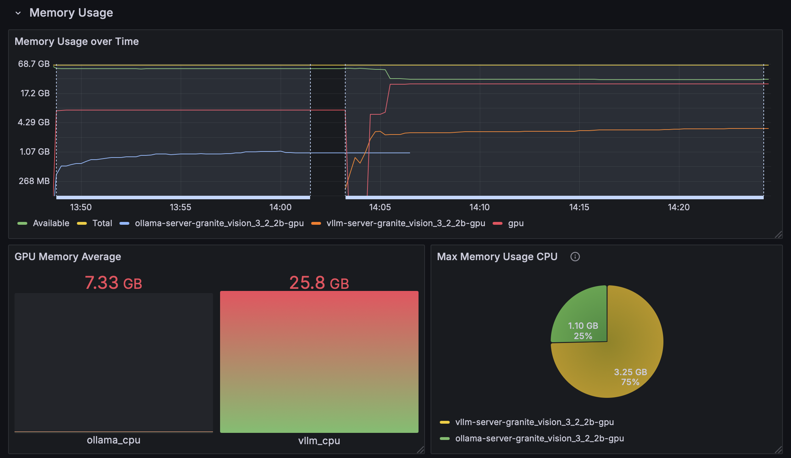
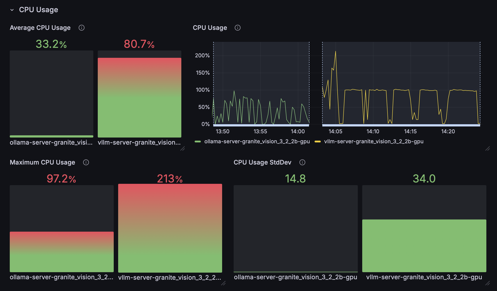

# AI Inference - A methodology for testing and comparing metrics of various AI stacks

The project displays on a Grafana Dashboard an array of metrics including:
- Power Consumption
- Memory Usage
- CPU Usage
- Latency/Throughput (vLLM only)
- Misc

## Project Output

 

### `python radar.py` after running a test will produce a side-by-side visual summary:

## Installation and Setup

Right now, the project is configured for Jetson machines only

### If using Jumpstarter to manage remote machine

- Must have valid [Jumpstarter](https://jumpstarter.dev/main/) credentials and configure properly

get a lease with Jumpstarter:

`uv run jmp shell -l board=orin-agx`

### Running the Project

After cloning the repo, running `python run.py` will start the project.
 - run.py will by default search for a configuration file named `run_config.yaml` in the same directory, but `--config_path` to change the name of the file that it will be looking for. See [template.yaml](template.yaml) for an example of what the yaml syntax should look like.

#### If using Jumpstarter, the first time you run the project with each new lease you will have to add `--powercycle True` to run.py

Once running, metrics will be visible on port 3000 on the Grafana dashboard.